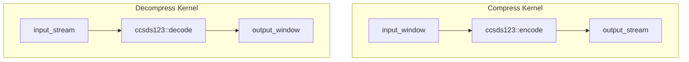

# System Overview

This document describes the architecture and implementation strategy for the multi-platform CCSDS 123.0-B-2 lossless image compression codec.

## High-level architecture

The project provides three parallel implementations targeting distinct execution environments:

1. **C++ reference codec** — A portable library with command-line tools for encoding and decoding.
2. **VHDL compressor** — A streaming hardware pipeline intended for FPGA synthesis.
3. **AI Engine kernels** — Experimental accelerators wrapping the C++ codec for AMD-Xilinx AIE tiles.

Each implementation shares a common algorithmic core defined by the CCSDS 123.0-B-2 standard, maintaining identical compression behaviour when configured with matching parameters.

## C++ codec structure

The C++ implementation resides in `src/cpp/` and consists of:

* `Ccsds123Codec.cpp` implements both the encoder and decoder with a container-based bitstream format. The encoder exposes two write modes: in-memory accumulation and streaming to external buffers. The decoder infers predictor settings from the container header to ensure every encoded payload can be reconstructed without manual configuration. 【F:src/cpp/src/Ccsds123Codec.cpp†L1-L730】
* `Ccsds123Params.h` defines the parameter structures controlling band ordering, local-sum configuration, weight initialisation, and sample-adaptive Golomb coding. 【F:src/cpp/include/Ccsds123Params.h†L1-L95】
* CLI tools (`ccsds123_encode`, `ccsds123_decode`) accept raw BSQ imagery and emit or consume containerised bitstreams with embedded metadata. 【F:src/cpp/src/main_encode.cpp†L1-L162】【F:src/cpp/src/main_decode.cpp†L1-L110】

The compressor operates in three stages:

1. **Local-difference calculation** computes directional gradients using the configured neighbour pattern.
2. **Prediction** combines scaled gradients with adaptive weights that update after each sample.
3. **Sample-adaptive Golomb coding** maps prediction residuals to variable-length codes based on the running accumulator.

## HDL compressor pipeline

The HDL implementation mirrors the C++ encoder with a pipelined dataflow architecture:

* `compressor.vhd` instantiates the control, local-difference, predictor, and coder modules inside a top-level wrapper that consumes BIP samples and emits packed bitstream bytes. 【F:src/hdl/src/compressor.vhd†L1-L234】
* `control.vhd` generates band, line, and column indices matching the BSQ-to-BIP transformation assumed by the test bench. 【F:src/hdl/src/control.vhd†L1-L152】
* `local_diff.vhd` implements the local-sum calculator with configurable neighbour selection. 【F:src/hdl/src/local_diff.vhd†L1-L203】
* `predictor.vhd` contains the weight-update and scaled-sum stages, maintaining per-band weight vectors in distributed RAM. 【F:src/hdl/src/predictor.vhd†L1-L287】
* `sa_coder.vhd` implements the sample-adaptive Golomb coder with a five-stage pipeline, matching the bit allocation logic in `SampleAdaptiveGolombEncoder`. 【F:src/hdl/src/sa_coder.vhd†L1-L188】
* `packer.vhd` collects variable-length code words from each pipeline lane, enforces the configured endianness, and emits `tlast` once the final byte has been flushed. 【F:src/hdl/src/packer.vhd†L1-L618】

## AI Engine implementation

The AI Engine prototype wraps the C++ codec inside kernels so experiments can run without reimplementing the predictor stack in dataflow C.

* `aie_kernel.cc` copies samples into on-chip buffers, invokes the shared C++ codec, and forwards the resulting bytes or pixels through the AIE window/stream interfaces. 【F:src/aie/aie_kernel.cc†L1-L45】
* `graph/ccsds123_graph.cpp` instantiates the compress/decompress kernels when targeting real hardware, and compiles away to a no-op placeholder in host-only builds. 【F:src/aie/graph/ccsds123_graph.cpp†L1-L33】

## Build and regression flow

1. `tools/gen_impl_params.py` reads `tools/conf.json` and emits both VHDL and Verilog parameter files so every implementation shares the same image dimensions and coder settings. 【F:tools/gen_impl_params.py†L1-L33】
2. `make run_compare` executes the C++ unit tests, compiles the reference codec, generates the gradient test cube, launches the Vivado simulation, and finishes by invoking `tools/compare_bitstreams.py` to validate the HDL payload against the software payload at both the byte and bit level while decoding each stream for a lossless round-trip. 【F:Makefile†L63-L109】
3. The comparison script can export the C++ payload (`--payload-output`) and now emits detailed mismatch diagnostics to speed up debug loops. 【F:tools/compare_bitstreams.py†L1-L348】

## Notes on header versions

* **Version 2 containers** exist so legacy payloads generated before the full predictor configuration was exposed remain decodable. The C++ decoder fills in the historical defaults for missing parameters to stay compatible with older data sets. 【F:src/cpp/src/Ccsds123Codec.cpp†L533-L546】
* **Version 3 containers** embed the complete predictor, mapper, and Golomb configuration. Both HDL regression tests and the AIE kernels rely on those fields to mirror the software behaviour exactly. 【F:src/cpp/src/Ccsds123Codec.cpp†L548-L568】

## Milestone status

The milestone tracker indicates that the first four upcoming tasks are complete and the remaining three are still open. 【F:MILESTONES.md†L3-L16】
