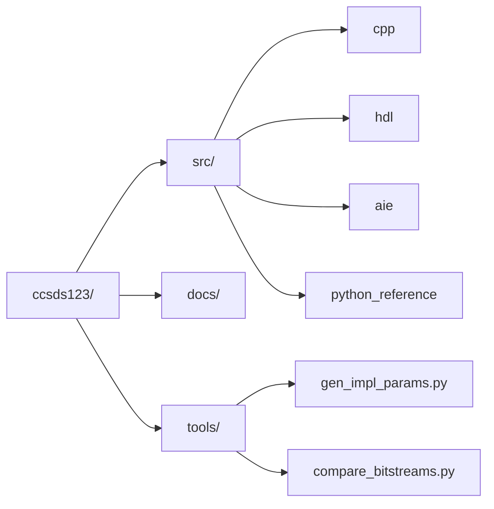
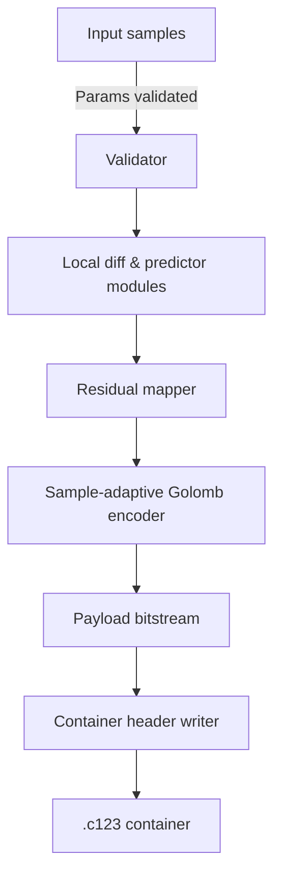
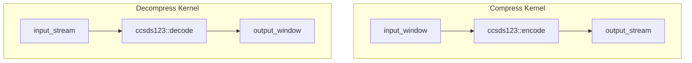

# CCSDS 123 Implementation Overview

This document captures how the repository ties the C++ software reference, RTL encoder, and AI Engine (AIE) model together. It also documents the generated artefacts, data paths, and build coordination so regressions such as payload mismatches can be diagnosed quickly.

## Repository layout

The project keeps each implementation in a dedicated subtree and shares common helpers under `tools/`.

* `src/cpp` – C++ encoder/decoder library, CLI utilities, and unit tests.
* `src/hdl` – synthesizable VHDL/Verilog for the hardware encoder and test bench scaffolding.
* `src/aie` – thin AIE graph that wraps the C++ codec for accelerator experiments.
* `tools` – scripts for parameter generation, stimulus preparation, and HDL vs. C++ payload comparison.

## C++ implementation

The library in `src/cpp` provides both a container format and the sample-adaptive coding pipeline used by the other implementations.

Key aspects:

* `Ccsds123Codec.cpp` defines two header layouts:
  * **Version 2** (`HeaderLayoutV2`) keeps only the legacy subset of CCSDS parameters and relies on defaults for weight-update tuning.
  * **Version 3** (`HeaderLayoutV3`) stores every predictor, mapper, and Golomb control field so the container round-trips to both HDL and AIE front-ends without extra configuration. 【F:src/cpp/src/Ccsds123Codec.cpp†L18-L43】【F:src/cpp/src/Ccsds123Codec.cpp†L512-L563】
* The CLI encoder (`ccsds123_encode_main.cpp`) fills a `Params` structure, runs `encode`, and writes the combined header+payload container that the comparison tooling consumes. 【F:src/cpp/src/ccsds123_encode_main.cpp†L20-L118】【F:src/cpp/src/ccsds123_encode_main.cpp†L184-L236】
* `tools/compare_bitstreams.py` unpacks either header version automatically, extracts the payload, and compares it to the HDL dump while reporting compression ratios. 【F:tools/compare_bitstreams.py†L11-L78】

## HDL implementation

The VHDL encoder mirrors the software pipeline with explicit staging, shared stores, and a byte packer that emits AXI-stream friendly output.

```mermaid
flowchart LR
    IN[AXIS samples] --> CTRL[control.vhd]
    CTRL --> STO[sample_store.vhd]
    STO --> LD[local_diff.vhd]
    LD --> DOT[dot_pipetree.vhd]
    DOT --> PRED[predictor.vhd]
    PRED --> WU[weight_update.vhd]
    WU --> RES[residual_mapper.vhd]
    RES --> SA[sa_coder.vhd]
    SA --> PACK[packer.vhd]
    PACK --> OUT[AXIS payload]
```

Highlights:

* `control.vhd` reproduces the CCSDS state machine: it tracks `(x, y, z)` positions, emits first/last markers, and computes the dynamic scaling exponent `p(t)` exactly as the C++ `ControlState`. 【F:src/hdl/src/control.vhd†L1-L115】
* `weight_update.vhd` now initialises the adaptive weights identically to the software model. Reduced-mode builds seed every component, while the full predictor keeps the three directional taps at zero until the first update. This prevents the large non-zero bias that previously inflated the HDL payload. 【F:src/hdl/src/weight_update.vhd†L56-L109】
* `sa_coder.vhd` implements the sample-adaptive Golomb coder with a five-stage pipeline, matching the bit allocation logic in `SampleAdaptiveGolombEncoder`. 【F:src/hdl/src/sa_coder.vhd†L1-L188】
* `packer.vhd` collects variable-length code words from each pipeline lane, enforces the configured endianness, and emits `tlast` once the final byte has been flushed. 【F:src/hdl/src/packer.vhd†L1-L618】

## AI Engine implementation

The AI Engine prototype wraps the C++ codec inside kernels so experiments can run without reimplementing the predictor stack in dataflow C.

* `aie_kernel.cc` copies samples into on-chip buffers, invokes the shared C++ codec, and forwards the resulting bytes or pixels through the AIE window/stream interfaces. 【F:src/aie/aie_kernel.cc†L1-L45】
* `graph/ccsds123_graph.cpp` instantiates the compress/decompress kernels when targeting real hardware, and compiles away to a no-op placeholder in host-only builds. 【F:src/aie/graph/ccsds123_graph.cpp†L1-L33】

## Build and regression flow

1. `tools/gen_impl_params.py` reads `tools/conf.json` and emits both VHDL and Verilog parameter files so every implementation shares the same image dimensions and coder settings. 【F:tools/gen_impl_params.py†L1-L33】
2. `make compare` compiles the C++ reference, generates the gradient test cube, launches the Vivado simulation, and finishes by invoking `tools/compare_bitstreams.py` to check that the HDL payload matches the software payload byte-for-byte. 【F:Makefile†L63-L101】
3. The comparison script can also export the C++ payload (`--payload-output`) so deeper debugging can be done without rerunning the encoder. 【F:tools/compare_bitstreams.py†L52-L71】

## Notes on header versions

* **Version 2 containers** exist so legacy payloads generated before the full predictor configuration was exposed remain decodable. The C++ decoder fills in the historical defaults for missing parameters to stay compatible with older data sets. 【F:src/cpp/src/Ccsds123Codec.cpp†L533-L546】
* **Version 3 containers** embed the complete predictor, mapper, and Golomb configuration. Both HDL regression tests and the AIE kernels rely on those fields to mirror the software behaviour exactly. 【F:src/cpp/src/Ccsds123Codec.cpp†L548-L568】

## Milestone status

The milestone tracker indicates that the first four upcoming tasks are complete and the remaining three are still open. 【F:MILESTONES.md†L3-L16】
